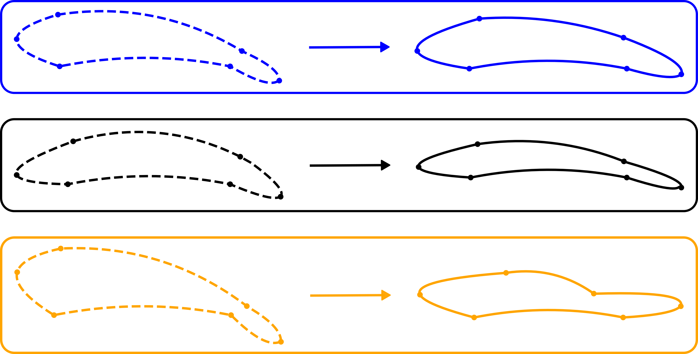

# Linkage Airfoil Optimization
<p align="center">
    
</p>

## Overview
This script performs an aerodynamic optimization process for airfoils and evaluates their aerodynamic efficiency. It generates airfoil geometries from optimization results, computes aerodynamic performance metrics, and visualizes the aerodynamic efficiency (CL/CD) against the angle of attack.

## Features
- Computes airfoil efficiency using `airfoil_efficiency` function.
- Generates airfoil coordinates using `generate_airfoil_dat_from_points` with optional visualization and smoothing.
- Performs aerodynamic analysis on the generated airfoils using `nf.get_aero_from_coordinates`.
- Plots the aerodynamic efficiency (CL/CD) over a range of angles of attack.
- Visualize the results

## Dependencies
Ensure the following Python libraries are installed:
```bash
pip install numpy matplotlib neuralfoil
```
More information about NeuralFoil can be found at the official repository:[NeuralFoil GitHub](https://github.com/peterdsharpe/NeuralFoil).

## Usage
1. Run the script to:
   - Generate airfoil geometries from optimization results (`result_1.x`, `result_2.x`, `result_3.x`).
   - Compute and plot aerodynamic efficiency over a range of angles of attack.

2. Modify parameters such as `trailing_edge_smooth_factor`, initial conditions (`x0`), Reynolds number (`Re`), and `alpha` range to explore different conditions.

## Output
- **Airfoil Data**: Airfoil geometries stored in variables `coords_1`, `coords_2`, `coords_3`.
- **Graph**: `initialization_graph.svg` showing the aerodynamic efficiency (CL/CD) vs. angle of attack.